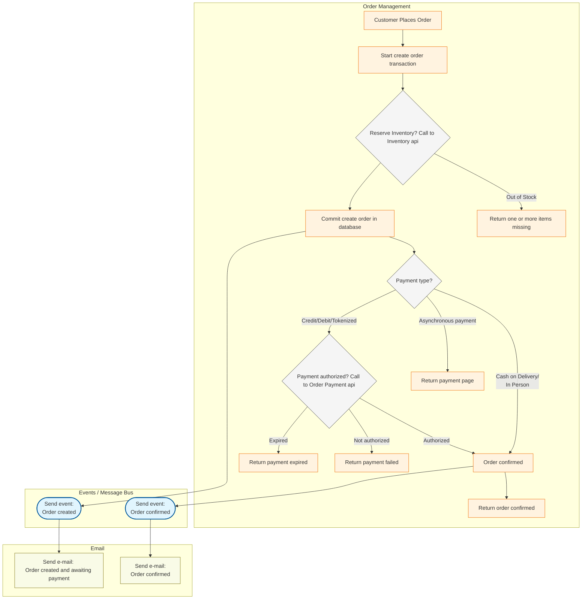
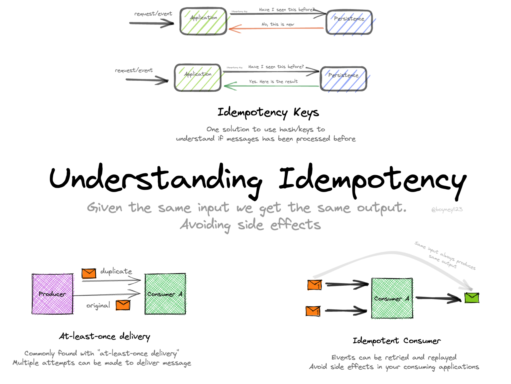
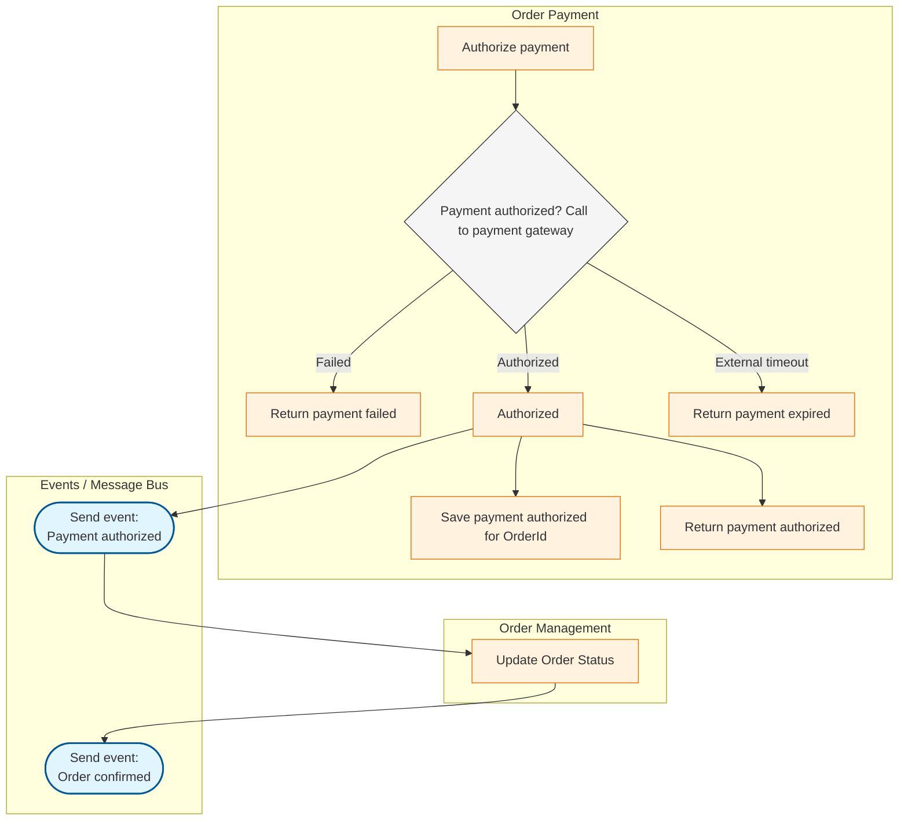
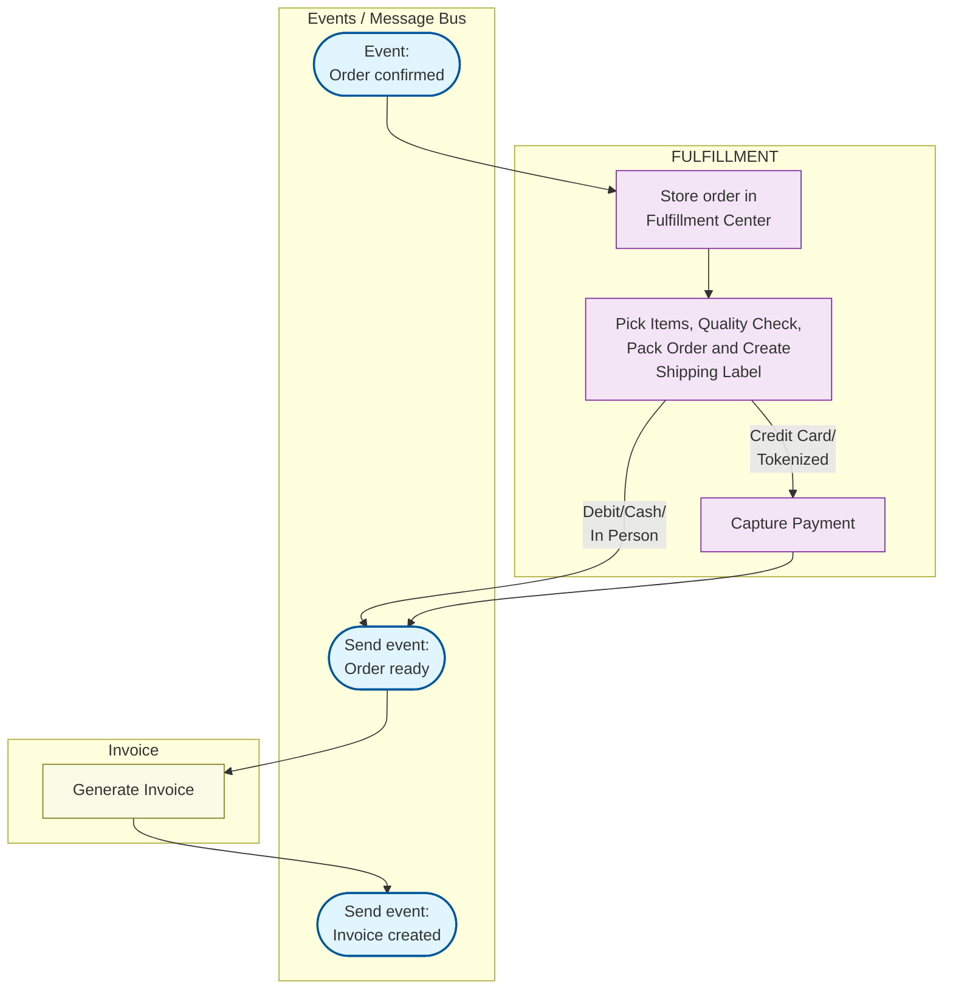
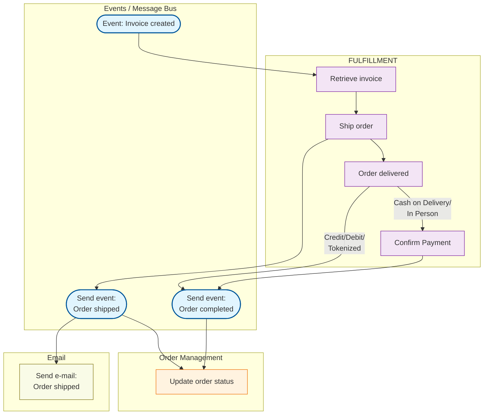

# Order-Management

## Order Creation

### Notes:

1 - Reserve/Lock Inventory:

- It should be an atomic operation at database level to avoid race conditions between multiple users in the same or on different application instances on the server/cloud.

2 - Transactional outbox pattern

- All the events sent should follow this pattern.
- Example: Save both order details and order created (outbox message) to the same database in a single transaction. A separate and decoupled process reads from the outbox table and publishes to a message broker and then it deletes the current outbox message. There is a very small chance that after a event being publish, for some reason (application is down, for example), the outbox message was not deleted. Thus, a duplicated order created event will be sent to message bus. To avoid this, we must implement Idempotency on the consumer side.

3 - Idempotency on the consumer side

- One solution is to store the fact that event has been processed. So, next time, if the same event is triggered, it will be acknowledge but no processed (Silently ignore it). You can hash the event payload and store in the database or use orderid as an unique idempotency key.
- Another solution, if possible, is to make the operation on the consumer side, idempotent. This way, the following duplicated events will result the same output. Example: UPDATE Orders SET Status = 'Processed' WHERE OrderId = 123 AND Status = 'Pending'.

3 - Synchronous/Async payment methods:

- Direct authorization via http request
- Authorize payment request via webhook or polling.

## Order Payment

## Fulfillment

## Order Deliver

