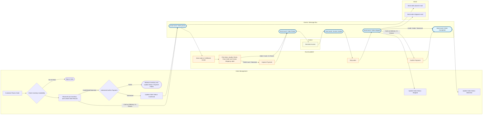

# Order-Management

```mermaid
flowchart LR
    %% Subgraph Styling
    classDef event fill:#e1f5fe,stroke:#01579b,stroke-width:2px;
    classDef logic fill:#f5f5f5,stroke:#333,stroke-width:1px;
    classDef fulfill fill:#fff3e0,stroke:#ef6c00,stroke-width:1px;
    classDef note fill:#f9fbe7,stroke:#827717,stroke-width:1px;

    subgraph Order_Management [Order Management]
        A[Customer Places Order] --> B{Check Inventory Availability}
        B -->|Out of Stock| C([Reject Order])
        B --> D[Reserve/Lock Inventory and Create Order Record]
        
        D --> |"Credit/Debit/Tokenized"| E{Authorize/Confirm Payment}
        E -->|Failed| F([Release Inventory and Update Status: Payment Failed])
        E -->|Authorized| G[Update Order Status: Confirmed]
        
        N[Update Order Status: Shipped]
        R[Update Order Status: Delivered]
    end

    subgraph Events [Events / Message Bus]
        H([Send event: Order placed])
        M([Send event: Order Ready])
        S([Send event: Invoice created])
        P([Send event: Order shipped])
        W([Send event: Order Completed])
    end

    subgraph Fulfillment [FULFILLMENT]
        K[Store order in Fulfillment Center]
        L[Pick Items, Quality Check, Pack Order and Create Shipping Label]
        V[Capture Payment]
        U[Ship order]
        Q[Confirm Payment]
    end

    subgraph Email [Email]
        I[Send order placed e-mail]
        O[Send order shipped e-mail]
    end

    subgraph Invoice [Invoice]
        J[Generate Invoice]
    end

    %% Logic to Events
    G --> H
    D --> |"Cash on Delivery / In Person"| H
    
    %% Event Distribution
    H --> I
    H --> K
    
    %% Fulfillment Flow
    K --> L
    L --> |"Credit Card / Tokenized"| V
    L --> |"Debit / Cash / In Person"| M
    V --> M
    
    %% Invoice & Shipping Flow
    M --> J
    J --> S
    S --> U
    U --> P
    
    %% Final Updates
    P --> O
    P --> N
    P --> |"Cash on Delivery / In Person"| Q
    P --> |"Credit / Debit / Tokenized"| W
    Q --> W
    W --> R

    %% Class Assignments
    class H,M,S,P,W event;
    class K,L,V,U,Q fulfill;
    class J note;
```