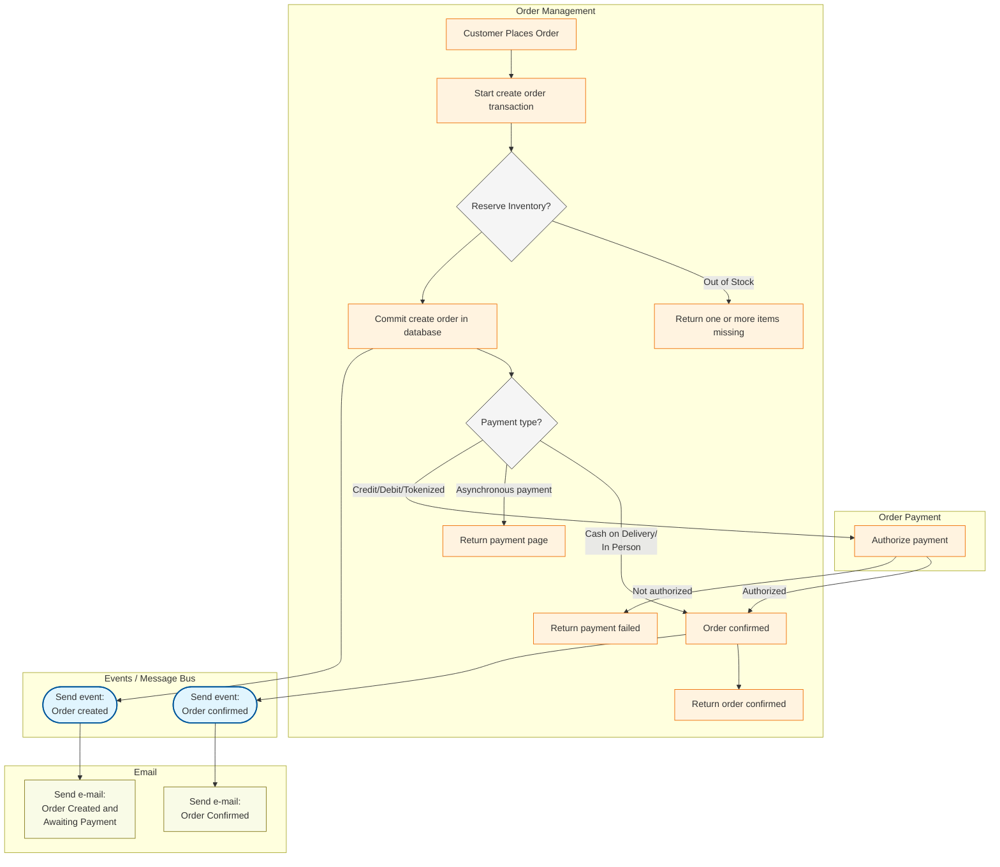
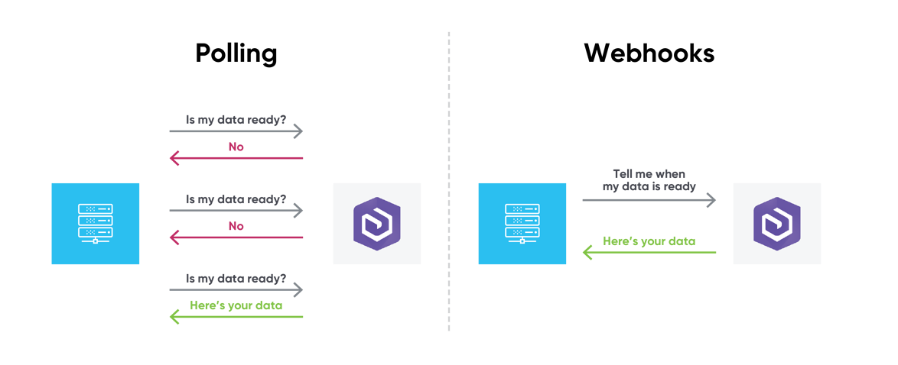
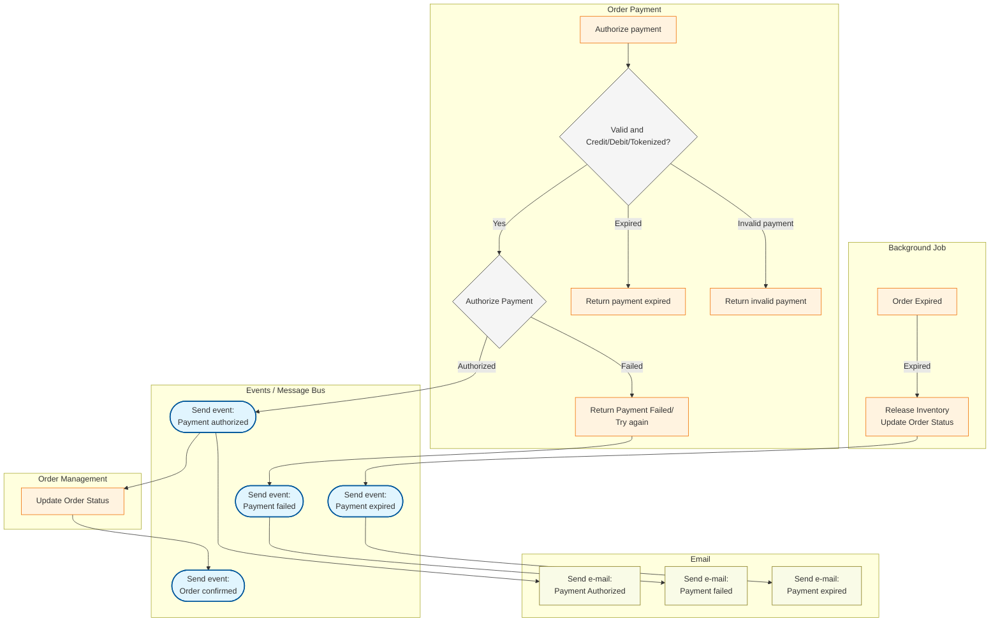
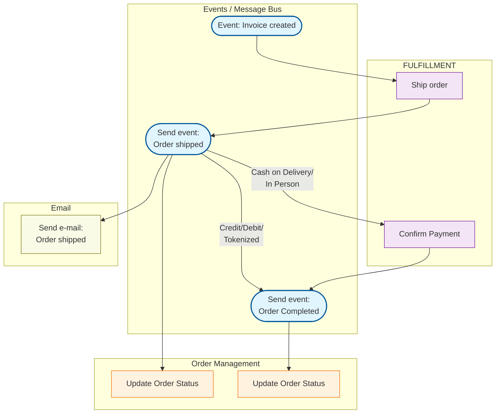

# Order-Management

## Order Creation

### Notes:

1 - Reserve/Lock Inventory:

- It should be an atomic operation at database level to avoid race conditions between multiple users in the same or on different application instances on the server/cloud.

2 - Transactional outbox pattern

- Save both order details and order created (outbox message) to the same database in a single transaction. A separate and decoupled process reads from the outbox table and publishes to a message broker and then it deletes the current outbox message. Still has a very small chance to not be able to delete outbox message and send more than 1 order created event to message bus. Need to implement Idempotency on the consumer side.

3 - Asynchronous vs Synchronous Payments

- Direct Authorization Http request to authorized during the Create Order request.
- Deferred Confirmation: Authorized after the Create Order request via Webhook.

## Order Payment

- For Asynchronous or Synchronous Payment

## Fulfillment

## Order Deliver

