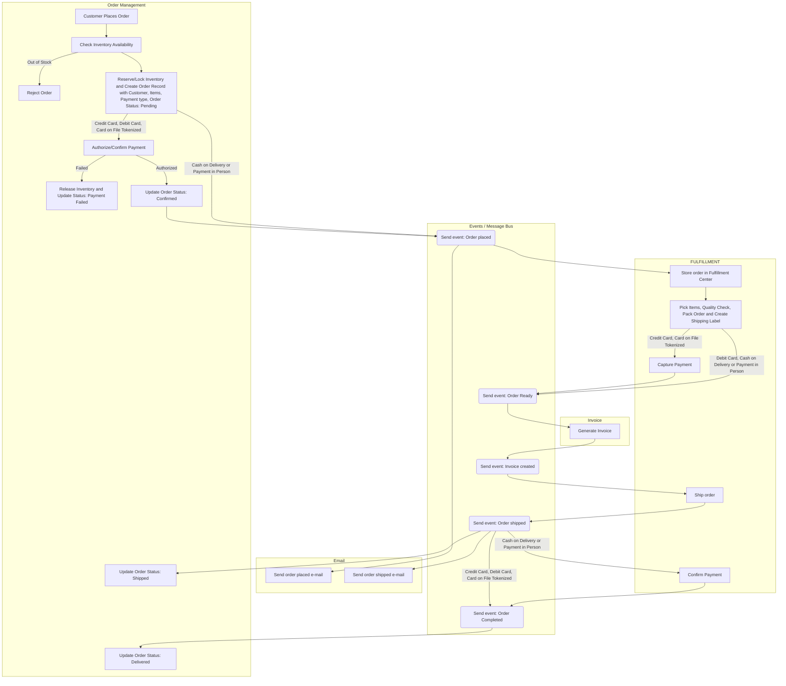

# Order-Management

```mermaid
flowchart TD

    subgraph Events [Events / Message Bus]
        H(Send event: Order placed)
        M(Send event: Order Ready)
        S(Send event: Invoice created)
        P(Send event: Order shipped)
        W(Send event: Order Completed)
    end

    subgraph Order_Management [Order Management]
        A[Customer Places Order] --> B[Check Inventory Availability]
        B -->|Out of Stock| C[Reject Order]
        B --> D[Reserve/Lock Inventory and Create Order Record with Customer, Items, Payment type, Order Status: Pending]
        D --> |Credit Card, Debit Card, Card on File Tokenized| E[Authorize/Confirm Payment]
        E -->|Failed| F[Release Inventory and Update Status: Payment Failed]
        E -->|Authorized| G[Update Order Status: Confirmed]
        G --> H
        D --> |Cash on Delivery or Payment in Person| H
        N[Update Order Status: Shipped]
        R[Update Order Status: Delivered]
    end

    subgraph Email [Email]
        I[Send order placed e-mail]
        O[Send order shipped e-mail]
    end

    subgraph Fulfillment [FULFILLMENT]
        K[Store order in Fulfillment Center]
        L[Pick Items, Quality Check, Pack Order and Create Shipping Label]
        V[Capture Payment]
        U[Ship order]
        Q[Confirm Payment]
    end

    subgraph Invoice [Invoice]
        J[Generate Invoice]
    end

    %% Connections between groups and events
    H --> I
    H --> K
    K --> L
    L --> |Credit Card, Card on File Tokenized| V
    V --> M
    L --> |Debit Card, Cash on Delivery or Payment in Person| M
    M --> J
    J --> S
    S --> U
    U --> P
    P --> O
    P --> N
    P --> |Cash on Delivery or Payment in Person| Q
    P --> |Credit Card, Debit Card, Card on File Tokenized| W
    Q --> W
    W --> R
```