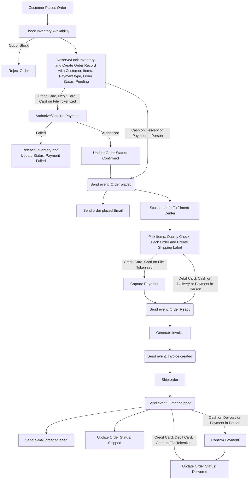

# Order-Management

```mermaid
flowchart TD
%% =========================
%% ORDER CAPTURE
%% =========================
A[Customer Places Order] --> B[Check Inventory Availability]
B -->|Out of Stock| C[Reject Order]
B --> D[Reserve/Lock Inventory and Create Order Record with Customer, Items, Payment type, Order Status: Pending]
D --> |Credit Card, Debit Card, Card on File Tokenized| E[Authorize/Confirm Payment]
E -->|Failed| F[Release Inventory and Update Status: Payment Failed]
E -->|Authorized| G[Update Order Status: Confirmed]
G --> H(Send event: Order placed)
D --> |Cash on Delivery or Payment in Person| H
H --> I[Send order placed Email]
%% =========================
%% FULFILLMENT
%% =========================
H --> K[Store order in Fulfillment Center]
K --> L[Pick Items, Quality Check, Pack Order and Create Shipping Label]
L --> |Credit Card, Card on File Tokenized| V[Capture Payment]
V --> M(Send event: Order Ready)
L --> |Debit Card, Cash on Delivery or Payment in Person| M(Send event: Order Ready)
M --> J[Generate Invoice]
J --> S(Send event: Invoice created)
S --> U[Ship order]
U --> P(Send event: Order shipped)
%% =========================
%% DELIVERY
%% =========================
P --> O[Send e-mail order shipped]
P --> N[Update Order Status: Shipped]
P --> |Cash on Delivery or Payment in Person| Q[Confirm Payment]
P --> |Credit Card, Debit Card, Card on File Tokenized| R
Q --> R[Update Order Status: Delivered]
```