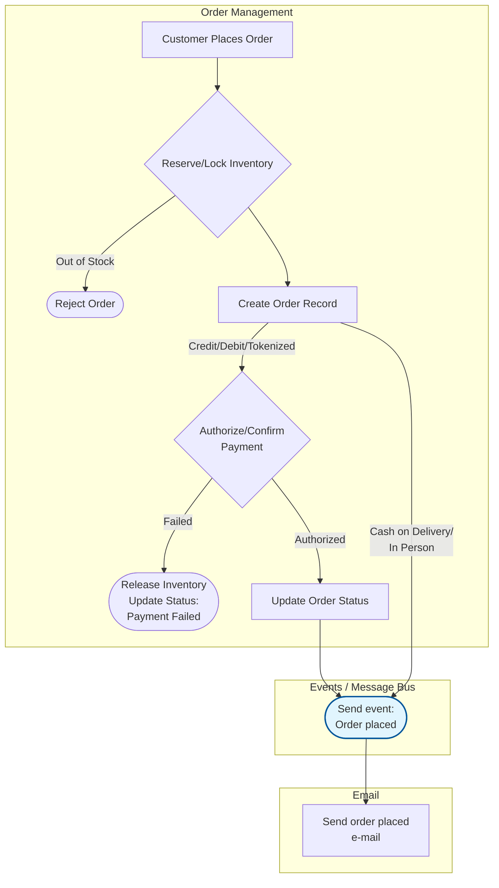
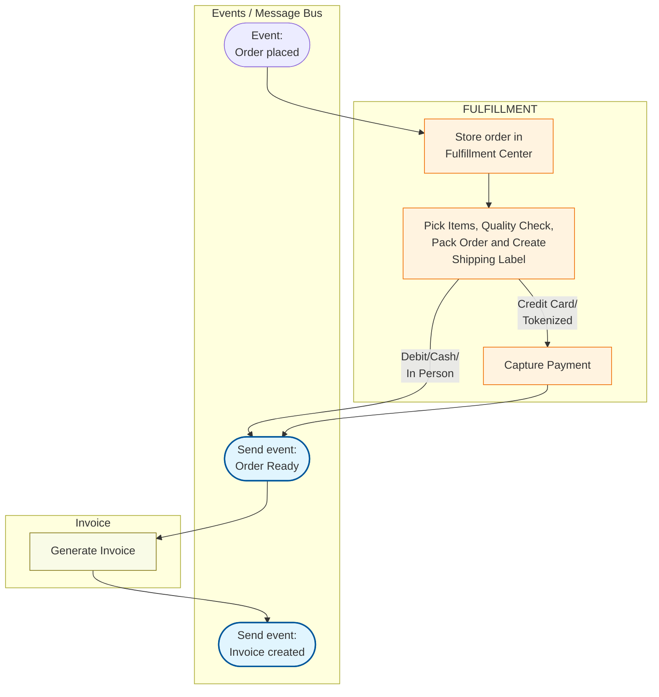
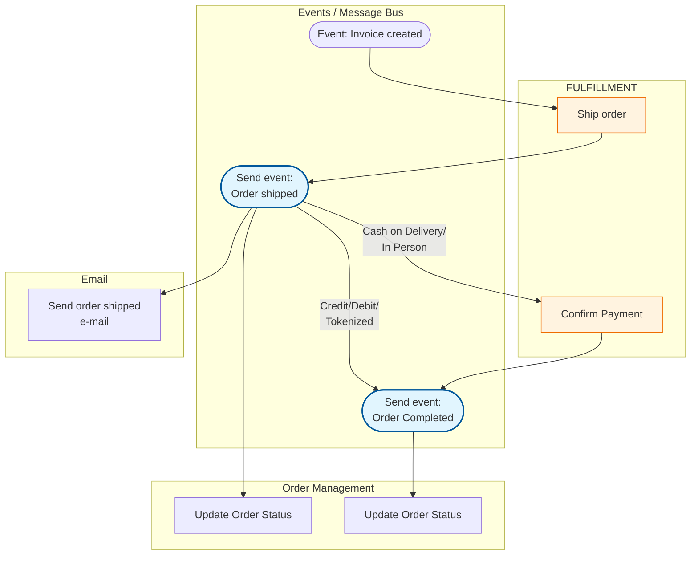

# Order-Management

## Order Creation

### Notes:

1 - Reserve/Lock Inventory:

- It should be an atomic operation at database level to avoid race conditions

2 - Order Status:

- It should have 2 status columns: Order Status and Payment Status.

2.1 - Digital Payment Flow

| Order Status       | Payment Status     | Trigger / Event                                                                 |
|--------------------|--------------------|----------------------------------------------------------------------------------|
| Pending            | Pending            | Order created; inventory reserved; redirecting to payment gateway.             |
| Awaiting Payment   | Authorized         | Card verified, but funds not yet captured (common in e-commerce).              |
| Confirmed          | Paid               | Payment confirmed by the bank or gateway.                                       |
| Canceled           | Failed             | Card declined or user abandoned the session.                                    |
| Canceled           | Expired            | Payment window timed out.                              |
| Canceled           | Refunded           | Order canceled by user/admin after payment was successful.                      |

---

2.2 - Order Lifecycle – Cash / Pay-on-Delivery Flow

| Order Status       | Payment Status | Trigger / Event                                                      |
|--------------------|---------------|----------------------------------------------------------------------|
| Confirmed          | Pending       | Order placed; no digital payment needed to start fulfillment.      |
| Out for Delivery   | Pending       | Logistics has the package; payment expected at delivery.           |
| Completed          | Paid          | Delivery person confirms receipt of cash/card in person.           |
| Canceled           | Unpaid        | Customer refused delivery or was not found at the address.         |

## Fulfillment

## Order Deliver

